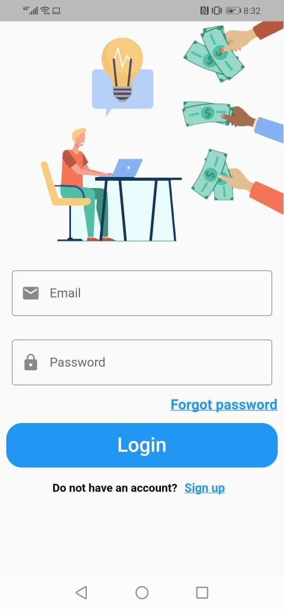
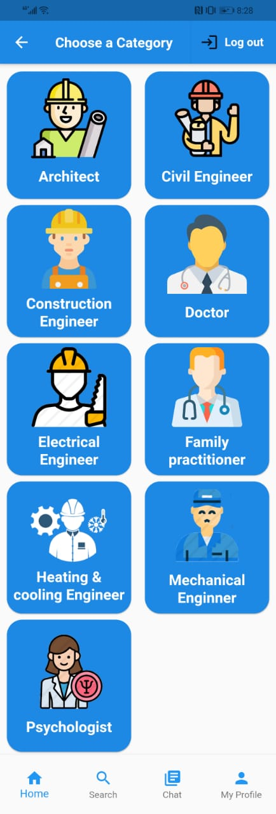
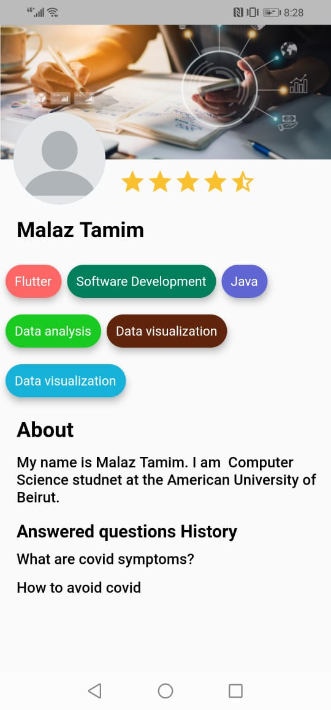
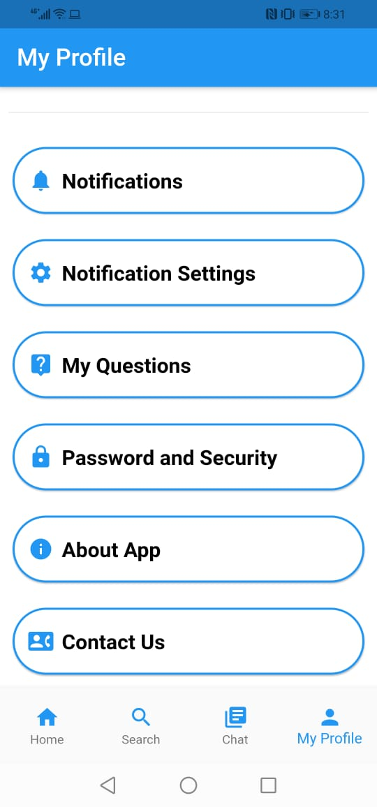

# Istishara
Istishara is a mobile app that helps clients consult an expert for some advice. The client can ask a question in one of several fields and then wait for experts to respond. The client then selects an expert based on his or her profile and can have a chat with the expert through the app. The clients can look for a certain expert and ask him/her to answer a specific question. The app works on both IOS and Android.

Frontend: Flutter

Backend: Dart and Firebase (Getx for state management)

## Getting Started

